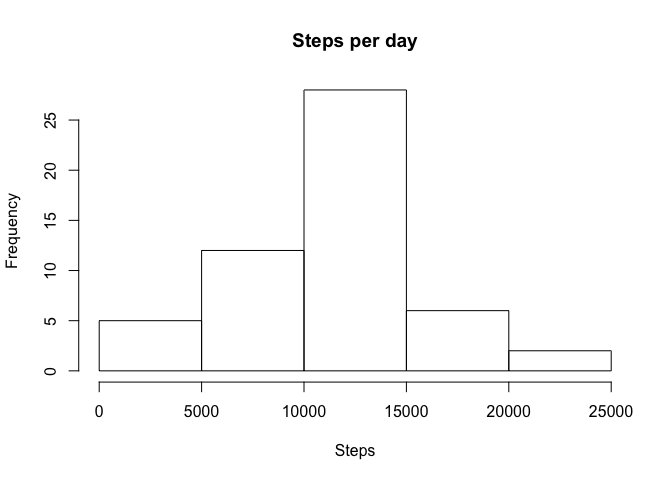
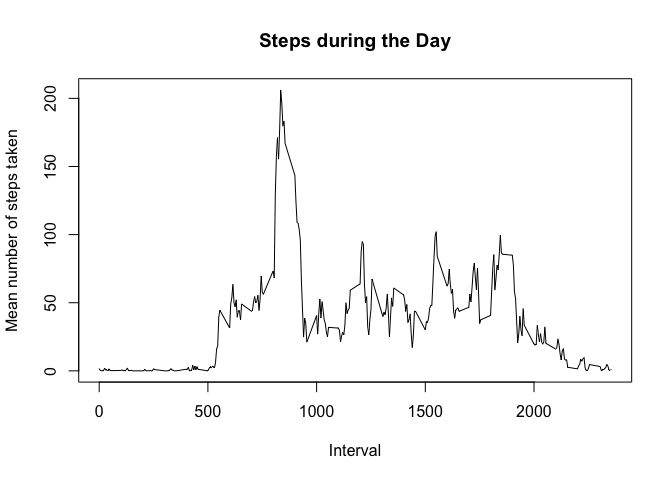

## Loading and preprocessing the data


```r
act<-read.csv("activity.csv")
```


## What is mean total number of steps taken per day?


```r
#calculate total number of steps per day
by_day<-aggregate(steps~date, data=act, sum)
colnames(by_day)<-c('date', 'steps')
hist(by_day$steps, main = "Steps per day", xlab = "Steps")
```

<!-- -->

```r
mean(by_day$steps)
```

```
## [1] 10766.19
```

```r
median(by_day$steps)
```

```
## [1] 10765
```
The mean number of steps taken per is 10766. The median number steps taken is 10765.

## What is the average daily activity pattern?


```r
by_interval<-aggregate(steps~interval, data=act, mean)
colnames(by_interval)<-c('interval', 'steps')
plot(by_interval$interval,by_interval$steps,type="l", 
     xlab="Interval",ylab="Mean number of steps taken", main="Steps during the Day")
```

<!-- -->

```r
by_interval$interval[which.max(by_interval$steps)]
```

```
## [1] 835
```
The interval with the highest number of steps is 835 (206.1698113 steps).

## Imputing missing values


```r
sum(is.na(act$steps))
```

```
## [1] 2304
```
There are 2304 row with missing values.


```r
#impute by replacing with interval mean where na.
act2 <- merge(x = act, y = by_interval, by = "interval", suffixes = c("", "avg"))
act2$steps<-ifelse(is.na(act2$steps), act2$stepsavg, act2$steps)
#redo the histgram
by_day2<-aggregate(steps~date, data=act2, sum)
colnames(by_day2)<-c('date', 'steps')
hist(by_day2$steps, main = "Steps per day", xlab = "Steps")
```

<!-- -->

```r
mean(by_day2$steps)
```

```
## [1] 10766.19
```

```r
median(by_day2$steps)
```

```
## [1] 10766.19
```
The mean and median are very similar to the data set without imputed values for nas. The frequency counts in the histogram are higher in the new histogram (as expected as there are now more data points), but the shape of the distribution is not affected. 


## Are there differences in activity patterns between weekdays and weekends?


```r
dow<-factor( weekdays(as.Date(act2$date)))
act2$weekday_weekend<-ifelse(dow=="Saturday"|dow=="Sunday", "weekend", "weekday")
by_int_w<-aggregate(steps~interval+weekday_weekend,data=act2, mean)
colnames(by_int_w)<-c("interval","weekday_weekend","steps")
library(lattice)
xyplot(by_int_w$steps ~ by_int_w$interval|by_int_w$weekday_weekend,by_int_w,type="l",
       layout=c(1,2),xlab="Interval",ylab="Number of Steps")
```

<!-- -->

